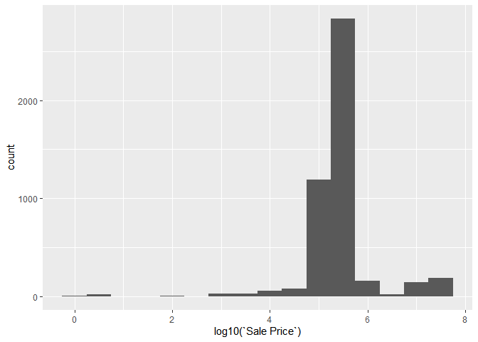
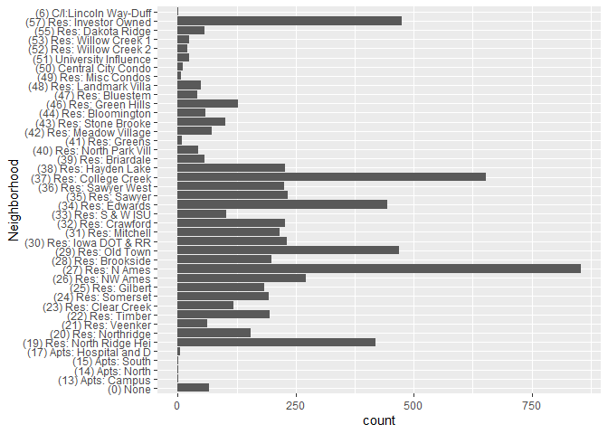
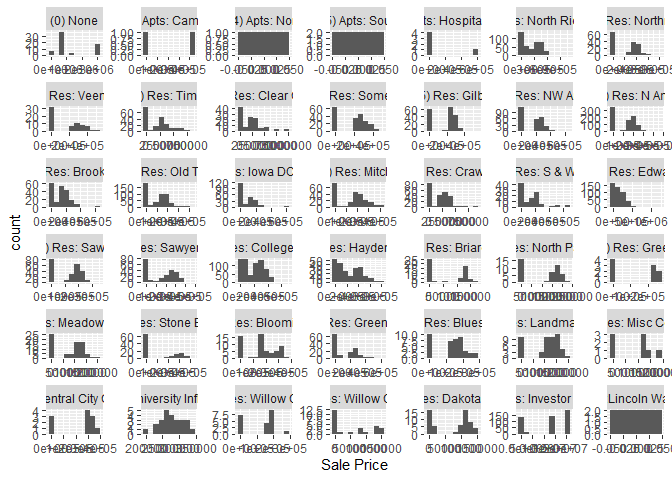
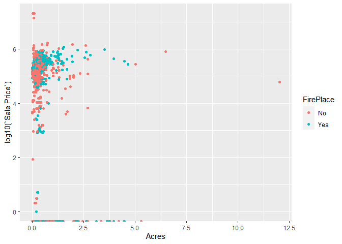

<!-- README.md is generated from README.Rmd. Please edit the README.Rmd file -->

# Lab report \#1

Follow the instructions posted at
<https://ds202-at-isu.github.io/labs.html> for the lab assignment. The
work is meant to be finished during the lab time, but you have time
until Monday evening to polish things.

Include your answers in this document (Rmd file). Make sure that it
knits properly (into the md file). Upload both the Rmd and the md file
to your repository.

All submissions to the github repo will be automatically uploaded for
grading once the due date is passed. Submit a link to your repository on
Canvas (only one submission per team) to signal to the instructors that
you are done with your submission.

1-3

1.   inspect the first few lines of the data set: what variables are there? of what type are the variables? what does each variable mean? what do we expect their data range to be?

There is the address of the property as well as pricing information and
other housing details. The variables are num, char, date types. The
variables describe information for each property such as style (numbers
for the style), occupancy, sale date/price, and living aspects such as
if it has a fireplace, total acres, type of neighborhood, and if it has
AC. We found that most variables are self explanatory for each
variables. Some that we thought were not self explanatory were Style
with 12 different levels, occupancy with a range of 5 levels, and
neighborhood with 42 levels describing if it was an apt on campus,
residential, etc.

2.  is there a variable of special interest or focus?

We determined that sale price was a good variable to focus on.

3.  start the exploration with the main variable: what is the range of
    the variable? draw a histogram for a numeric variable or a bar
    chart, if the variable is categorical. what is the general pattern?
    is there anything odd? follow-up on oddities: see 4

``` r
library(classdata)
library(ggplot2)

ggplot(ames, aes(x = log10(`Sale Price`))) +
  geom_histogram(binwidth = 0.5)
```

    FALSE Warning: Removed 2206 rows containing non-finite values (`stat_bin()`).

<!-- -->

The range is 0 to 20500000 dollars. After making the histogram for the
Sale Price variable, we saw that most of the houses fall in between a
price of 4.75 to 6.75 or \$31622 to \$316228. There were no odd
patterns.

4.  pick a variable that might be related to the main variable.
    - what is the range of that variable? plot. describe the pattern.
      what is the relationship to the main variable? plot a scatter
      plot, box plot or faceted bar charts (depending on the types of
      variables involved). Describe overall pattern, does this variable
      describe any oddities discovered in 3? Identify/follow-up on any
      oddities.

Blake

I think that a variable that could be closely associated with the sales
price is Neighborhood. The range of the variable is 0 - 57 representing
a categorical factor with 42 levels.

``` r
ggplot(ames, aes(x = Neighborhood)) +
  geom_bar() +
    coord_flip()
```

<!-- -->

It looks like most houses are located in the residential area which
would be expected with most in North Ames, College Creek, North Ridge
Heights, and Investor Owned houses.

``` r
#bar charts
ggplot(ames, aes(x = `Sale Price`)) +
  geom_histogram(bins = 10) +
  facet_wrap( ~ Neighborhood, scales = "free")
```

<!-- -->

It seems that the Sale Price for Neighborhoods like S and W ISU and
Campus apartments are much higher than other residential areas which
makes sense. Tee apartments North, Apartments South, and Lincoln Way -
Duff are all 0 which is not explained in documentation of the data set
and could possibly explain some low values in number 3.

Dhairya

``` r
#Commented because it is not working
#hist(ames$`Sale Price`, ames$`TotalLivingArea (sf)`, 
    # xlab = "Sale Price", ylab = "TotalLivingArea", 
    # main = "Sale Price vs. TotalLivingArea")
```

This Histogram plots a comparative value between Sale Price (log) and
TotalLivingArea (sf). This shows that the TotalLivingArea data is
ranging from 100 square feet to 3000 square feet.

Hazer

``` r
ggplot(ames, aes(x = Acres, y = log10(`Sale Price`), color = FirePlace)) +
  geom_point()
```

    FALSE Warning: Removed 89 rows containing missing values (`geom_point()`).

<!-- --> I picked the
acres variable which ranges from 0-7 acres. There is no linear
relationship between the variables and all the points are just bunched
up together. We have a few outliers with larger number of acres but they
tend to be more expensive as we would expect, thus we don’t see any
oddities in this plot.
